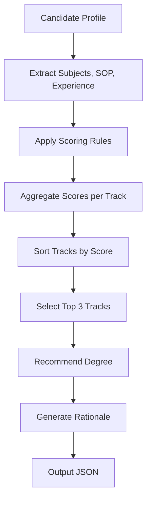

# Healthcare Career Track Classifier

## Overview
This project implements a classification system that maps candidate profiles to suitable healthcare career tracks and recommends an appropriate graduate degree.

The system is designed focusing on interpreting a candidate’s academic background, experience, and statement of purpose (SOP) to determine the best-fit career direction.

---

## Approach

I used a **hybrid rule-based scoring approach**:

- Each candidate is evaluated across multiple dimensions:
  - Subjects (academic background)
  - SOP (intent and goals)
  - Experience (practical exposure)

- Each of these contributes to scores across 11 predefined healthcare career tracks.

- The system:
  1. Assigns weighted scores based on matching signals
  2. Ranks all tracks
  3. Selects the top 3 tracks
  4. Recommends a degree based on the highest scoring track

---

## Career Tracks

The classifier uses the following predefined tracks:

- T01 – Healthcare Administration
- T02 – Consulting & Advisory
- T03 – Healthcare Finance
- T04 – Behavioral Health
- T05 – Public Health
- T06 – Epidemiology & Analytics
- T07 – Policy & Advocacy
- T08 – Environmental Health
- T09 – Digital Health & Informatics
- T10 – Life Sciences & Research
- T11 – Entrepreneurship & Innovation

---

## Degree Mapping

Each track maps to a recommended degree:

| Track | Degree |
|------|--------|
| T01 | MHA |
| T03, T11 | MBA-HC |
| T05, T06, T07 | MPH |
| T09 | MSHI |

---

## System Flow



---

## Example Output

```json
{
  "name": "Sample_MSHI_Tech_01",
  "top_3_tracks": [
    "T09_Digital_Health",
    "T01_Healthcare_Admin",
    "T02_Consulting"
  ],
  "recommended_degree": "MSHI",
  "rationale": "The candidate’s background and interests strongly align with Digital Health, supported by technical skills and experience.",
  "scores": {
    "T09_Digital_Health": 11
  }
}
```
---

## Key Design Decisions

- **Rule-based instead of ML**
  - Chosen for transparency, interpretability, and ease of explanation.
- **SOP-based scoring**
  - Captures intent, which is critical for career alignment.
- **Top-3 ranking instead of single output**
  - Reflects realistic ambiguity in career pathways.
- **Edge case handling**
  - If insufficient data is present, the system returns `"Undetermined"`.

---

## Assumptions

- Keywords in subjects and SOP reasonably represent candidate intent
- Experience descriptions contain meaningful signals
- Degree recommendation is driven primarily by the top-ranked track

---

## Limitations

- Relies on keyword matching (not semantic understanding)
- Does not use NLP models for deeper SOP analysis
- Weighting is heuristic and can be further refined

---

## Future Improvements

- Use NLP models for better SOP understanding
- Dynamic weight learning using training data
- Add confidence scoring for each recommendation
- Build a simple UI for interaction

---

## AI Usage

AI tools were used for structuring and refining code.
However, all classification logic, scoring rules, and decision-making were designed and implemented independently.

---

## How to Run

```bash
python main.py
```

---

## For Contributing
If you want to contribute to this project, please follow these steps:
- `Fork` the repository.
- Create a new branch `(git checkout -b feature/your-feature-name)`.
- Make your changes and commit them `(git commit -m 'Add some feature')`.
- Push to the branch `(git push origin feature/your-feature-name)`.
- Open a pull request.

---

## Project Maintainer
**Github:** [Swedeshna Mishra](https://github.com/SwedeshnaMishra)
